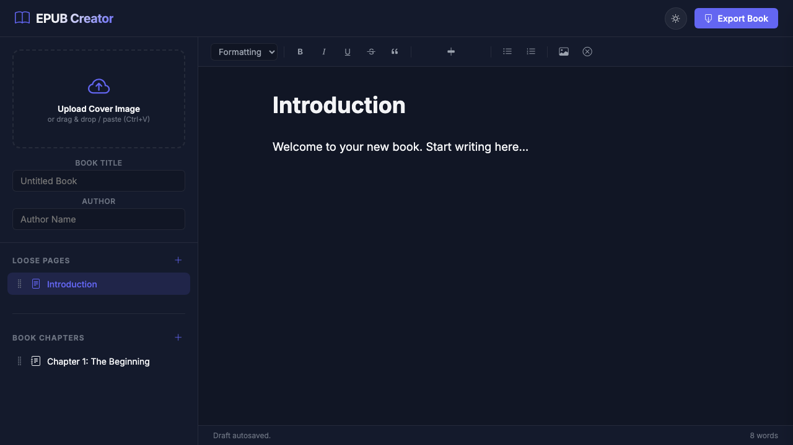

# EPUB & PDF Creator

A premium, client-side Single Page Application (SPA) to write e-books, style sections, import Markdown, paste images, and export clean, valid Kobo EPUBs (`.epub` / `.kepub.epub`) or printable PDFs.



## Running Locally

Serve the workspace using any static HTTP server:

```bash
npx http-server -p 8080
```

Open `http://localhost:8080` in your web browser.

